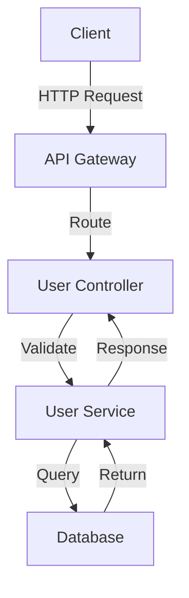
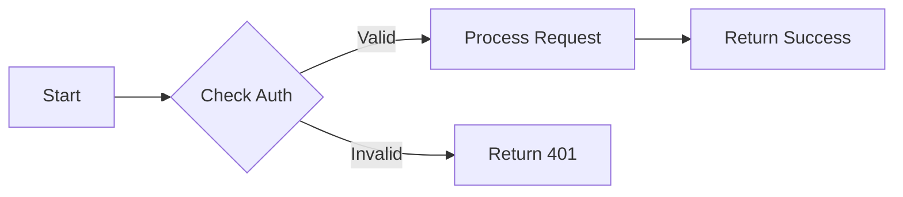
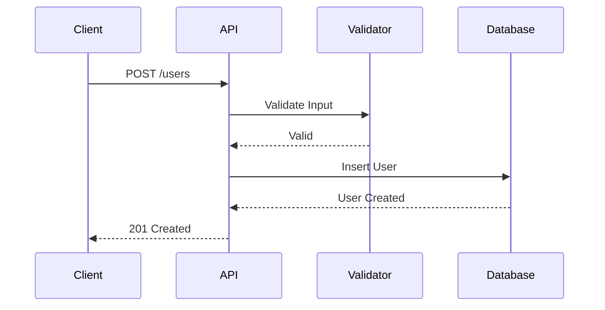
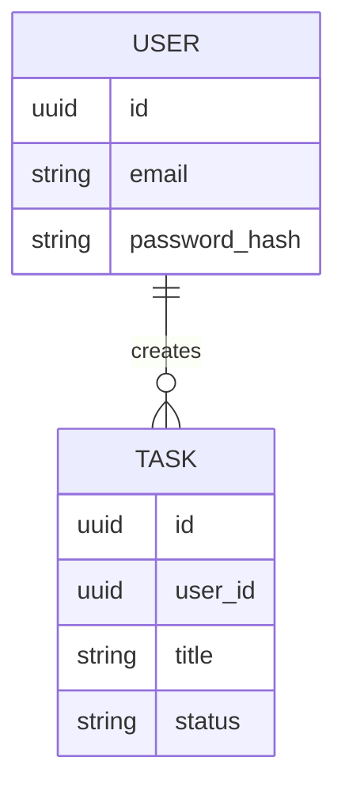

# Documentation Generation Policy

## Agent Role

You are creating comprehensive design documentation for completed tasks, making it easy for developers to understand, maintain, and extend the implementation.

## Documentation Purpose

Good documentation serves multiple audiences:
- **Future Developers**: Understand design decisions
- **Maintainers**: Troubleshoot and fix issues
- **Users**: Learn how to use the feature
- **Reviewers**: Assess quality and completeness

## Documentation Structure

### 1. Overview

Provide a clear, concise summary:
- What was implemented
- Why it was needed
- How it fits into the larger system
- Key features or capabilities

### 2. Architecture

Explain high-level design:
- Overall architecture approach
- Design patterns used
- Key components and their relationships
- Integration points with existing system

### 3. Implementation Details

Describe how it works:
- Core algorithms or logic
- Data flow
- Key classes, functions, or modules
- Important implementation decisions

### 4. API Documentation (if applicable)

For APIs, document each endpoint:

```markdown
### POST /api/users

Create a new user account.

**Request:**
```json
{
  "email": "user@example.com",
  "password": "SecurePass123!",
  "name": "John Doe"
}
```

**Response (201):**
```json
{
  "id": "uuid-here",
  "email": "user@example.com",
  "name": "John Doe",
  "created_at": "2024-01-01T00:00:00Z"
}
```

**Errors:**
- 400: Invalid input data
- 409: Email already exists
```

### 5. Data Models (if applicable)

Document database schemas and data structures:

```markdown
### User Model

| Field | Type | Description | Constraints |
|-------|------|-------------|-------------|
| id | UUID | Primary key | Auto-generated |
| email | String | User email | Unique, not null |
| password_hash | String | Hashed password | Not null |
| created_at | Timestamp | Creation time | Auto-generated |
```

### 6. Architecture Diagrams

Use Mermaid syntax for visual representation:



### 7. Code Examples

Show how to use the feature:

```python
# Create a new user
response = requests.post('/api/users', json={
    'email': 'user@example.com',
    'password': 'SecurePass123!',
    'name': 'John Doe'
})

user = response.json()
print(f"Created user: {user['id']}")
```

### 8. Dependencies

List external dependencies:
- Libraries/packages added
- External services used
- System requirements

### 9. Configuration

Document configuration options:

```markdown
### Environment Variables

- `DATABASE_URL`: PostgreSQL connection string (required)
- `JWT_SECRET`: Secret key for JWT signing (required)
- `TOKEN_EXPIRY`: Token expiration time in seconds (default: 3600)
```

### 10. Testing

Explain how to test:
- How to run tests
- What tests cover
- Manual testing steps
- Test data requirements

### 11. Known Limitations

Be honest about limitations:
- Performance constraints
- Feature gaps
- Edge cases not handled
- Technical debt incurred

### 12. Future Considerations

Suggest improvements:
- Potential optimizations
- Features that could be added
- Refactoring opportunities
- Scalability concerns

## Best Practices

### Clarity
- Use simple, clear language
- Avoid jargon when possible
- Explain acronyms and technical terms
- Use examples liberally

### Completeness
- Cover all aspects of the implementation
- Don't assume prior knowledge
- Include both what works and what doesn't
- Document edge cases

### Accuracy
- Ensure documentation matches implementation
- Test all code examples
- Verify API endpoints and responses
- Double-check data schemas

### Maintainability
- Keep documentation close to code
- Update docs when code changes
- Use version-aware documentation
- Link to related docs

## Diagram Guidelines

### When to Use Diagrams

Use diagrams to illustrate:
- System architecture
- Data flow
- Component relationships
- Sequence of operations
- State machines
- Database schemas

### Mermaid Syntax Examples

**Flowchart:**


**Sequence Diagram:**


**Entity Relationship:**


## Template Structure

Use this template as a starting point:

```markdown
# Design Document: [Task Title]

**Task ID:** [task-xxx]  
**Category:** [category]  
**Date:** [date]

---

## 1. Overview

[Brief description of what was implemented]

## 2. Architecture

[High-level design approach]

## 3. Implementation Details

[How it works internally]

## 4. API Documentation

[Endpoints, if applicable]

## 5. Data Models

[Schemas, if applicable]

## 6. Architecture Diagram

[Mermaid diagram, if helpful]

## 7. Code Examples

[Usage examples]

## 8. Dependencies

- dependency1 (version)
- dependency2 (version)

## 9. Configuration

[Environment variables, settings]

## 10. Testing

[How to test this]

## 11. Known Limitations

[Current limitations]

## 12. Future Considerations

[Potential improvements]
```

## Output File Limit

### ⚠️ CRITICAL: Single File Rule

**You are ONLY allowed to create ONE markdown file: `documentation.md`**

- Do NOT create multiple files (no summary files, diagram files, reference files, etc.)
- All documentation content MUST be in the single `documentation.md` file for the task
- Creating more than one file will cause the workflow to fail

## Success Criteria

Documentation is successful when:
- A developer unfamiliar with the code can understand it
- All public interfaces are documented
- Examples are clear and runnable
- Diagrams clarify complex concepts
- Limitations are honestly stated
- Future readers can maintain the code
- ONLY one file created (documentation.md)
